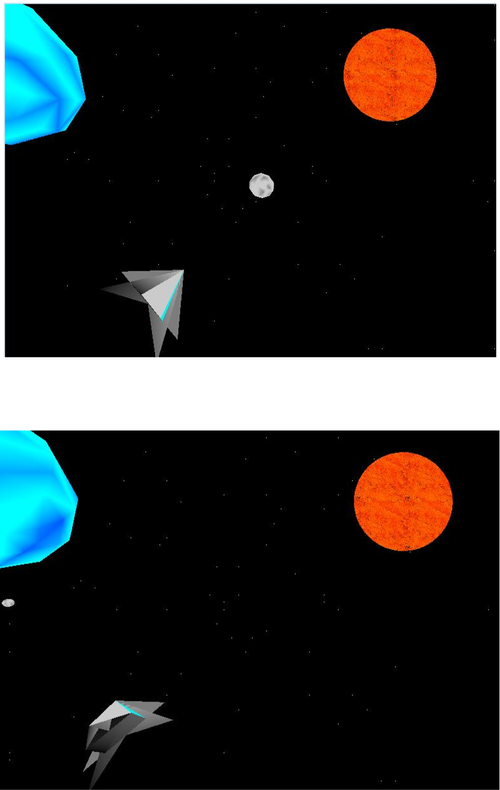
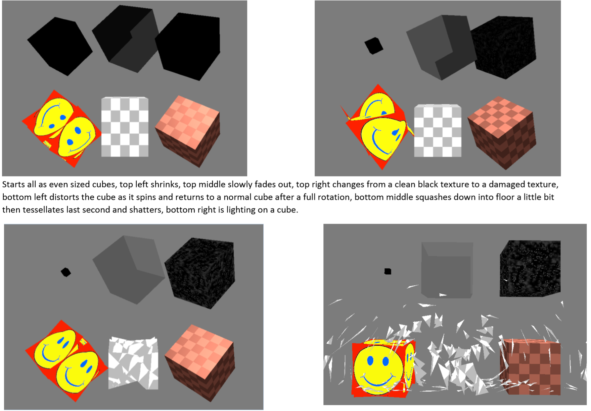
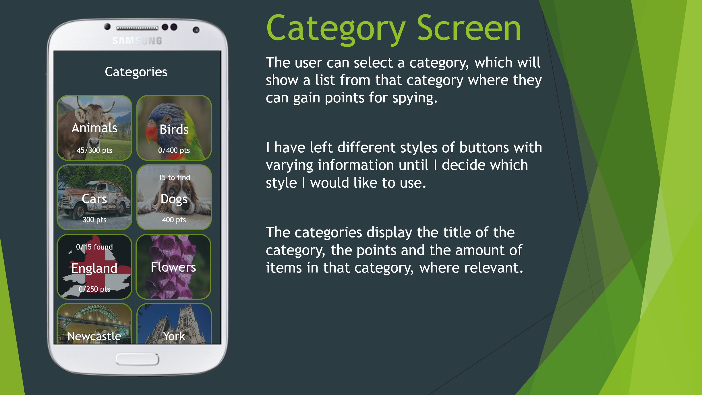
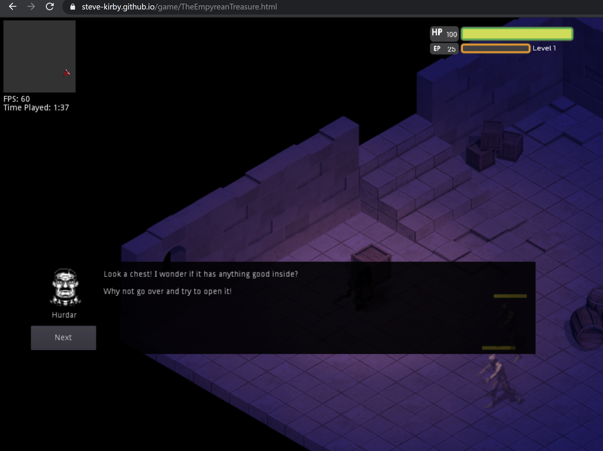
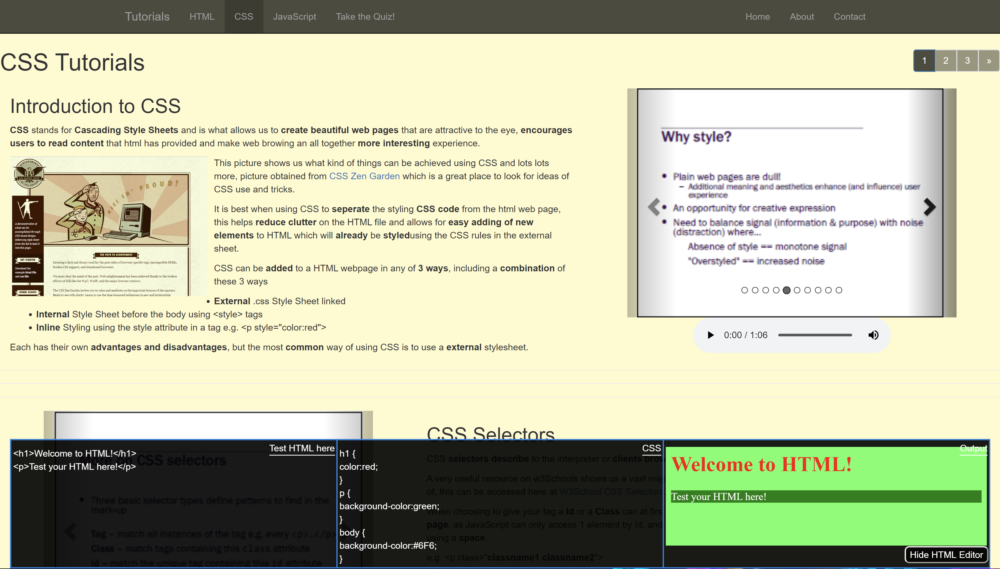
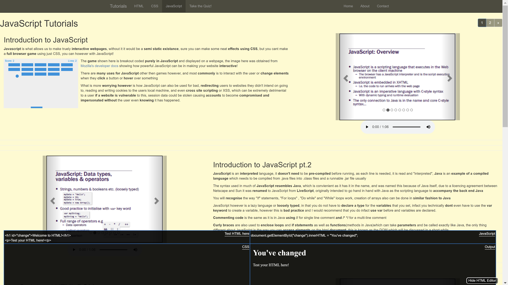

<h1 style="text-align:center;margin-top:20px;">Coursework - Highlights</h1>

<h2><a href="/Dissertation.pdf">Dissertation - Generation of Islands and Simulating Climate Change using OpenGL</a></h2>

 My dissertation is available to read online(.pdf) at the link above.

	

		
	

	

		<h3>Poster</h3>
		
For my 3rd year dissertation I wanted to explore graphics within programming as id never quite grasped how to implement them.

		
Tackling this topic enabled me to explore the belly of the beast, I utilised a codebase provided to us during the graphics module I was doing that year.

		
This provided a framework in which to easily set up a window using OpenGL as well as a few other features, however understanding the codebase I had never used before made this slightly more difficult; albeit increasing my confidence in using anothers complex code.

		
I enjoy games with wide open worlds that can be explored so decided i would generate random islands, this changed after discussion with my tutors.

		
 The biggest change was to incorperate climate change and rising sea levels, which are returning to the forefront of issues we face once again.

		
I made the decision to use heightmaps of the UK rather then randomly generated islands, in hopes of making people aware that these are real issues, not just an interesting graphics demo.

	

	

		<h3>Data Analysis Graph</h3>
		
Another aspect of this dissertation I enjoyed was the data analysis of testing performance of the simulation with different detail or tesselation levels, amount of textures being rendered etc.

		
This is just one example of the graphs I produced in Excel, this particular graph using the fps, x and y position of the 'camera' to see how much the render times/fps were effected by how much of the model was showing on the screen.

	

	

		
	

  
<h2><a href="#">Graphics - OpenGL</a></h2>

	

		
	

	

		<h3>Assignment 1 - Space Scene</h3>
		
Using OpenGL to create a space scene which needed to incorporate the sun, stars, a planet and a spaceship (user controlled).

		
I also added in a moving comet which randomly starts at a location in the distance and flys towards the player, when leaving the screen it starts somewhere randomly in the distance again.

	

	

		<h3>Assignment 2 - Shaders</h3>
		
Using OpenGL and GLSL I was to create four requested effects on cubes, and come up with two of my own.

		
The two that I came up with on my own were the shattering cube and the twisting smiley cube.

	

	

		
	

<h2><a href="#">iSpy - Android App</a></h2>

	

		
		
<a href="/ISpyPP.pptx">Download Powerpoint(23.1mb), with business case (embedded word document).</a>

		  
		
	

	

		<h3>Moodboard, Fontboard, Storyboard and Business Case</h3>
		
This stage was designing and developing ideas for the app, once I had started the storyboard I had a pretty good idea of what I wanted the app to look like.

		
I also kept track of any ideas or problems I came across for the app in a spreadsheet

	

	

		<h3>Coding the App</h3>
		
In this stage we programmed our apps using Android Studio, i used Java for this rather then Kotlin.

		
The embedded <a href="https://www.youtube.com/watch?v=wm44R9TGu7s">Youtube video shows the app in action</a> with voice over explaining what I am doing on the app.

		
I then wrote a reflective essay on my experience designing and programming the app, highlighting what went right and what went wrong, as well as what I had learnt from this assignment.

	

	

		<iframe width="90%" height="350" src="https://www.youtube.com/embed/wm44R9TGu7s"> </iframe>
	

	

  
<h2><a href="https://steve-kirby.github.io/game/TheEmpyreanTreasure.html">Game Development - Godot</a></h2>

Link above takes you to a 'playable in browser' version of this prototype game.

	

		
	

	

		<h3>Godot - Exported to HTML</h3>
		
The screenshot shows the game in action, it isnt perfect and it was extremely ambitious for the time I had to work with along side looming deadlines for other modules and my dissertation, but more importantly I learned a lot about Godot and game development in general whilst making this prototype game.

	

	
<h2><a href="https://github.com/Steven-Kirby/Seaton-Valley-Council-App">Team Project - Seaton Valley Council - Android App</a></h2>

 Link above leads to a git repository with only the code which was written by myself or a team member for this app and as such wont work as an imported project. 

	

		
	

	

		
As part of our <em>Software Engineering - Group Project</em> module we were to design and develop an android app, this could be a variety of different options chosen by the university.

		
We decided as a group to take on the Seaton Valley Council app, which could provide information to residents of the parish.

		
The gif here shows the app in use, for this project I was lead programmer along with 2 other programmers and 2 testers, ensuring any code pushed using gitlab was functional and could integrate with previous code.

	

  <h2><a href="#">Tutorial Website</a></h2>
  

  

      
	  
  

  

	  
Voice clips and slides from the course are laid out in easy to use sections seperating the different topics of the course

	  
The user can use what they learn from the website and gain feedback immediately by using the live HTML, CSS, Javascript testing area, this was adapted from some code found online, the layout changes depending on what section of the tutorial website the user is on (shown in the pictures).

  

