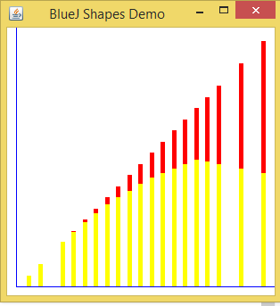
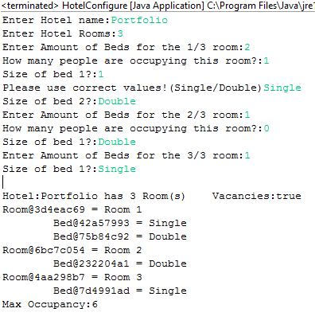
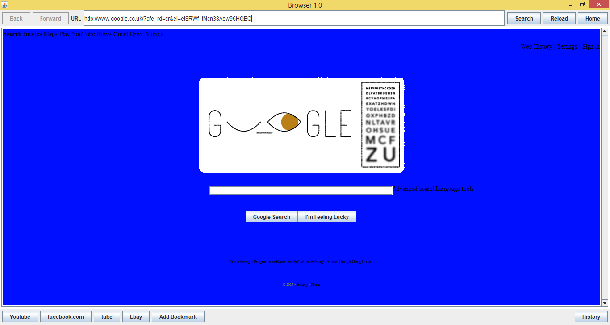
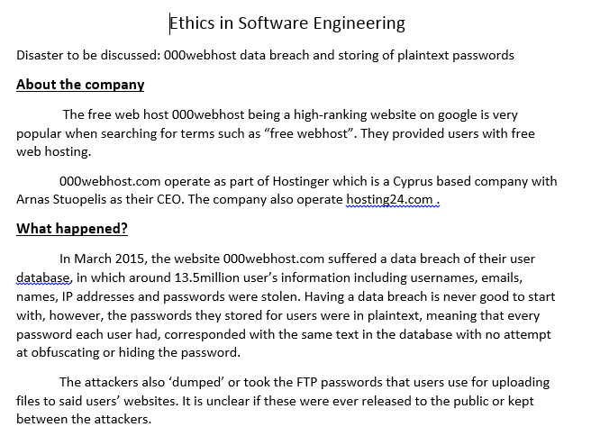
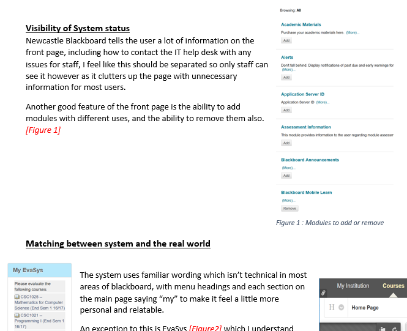
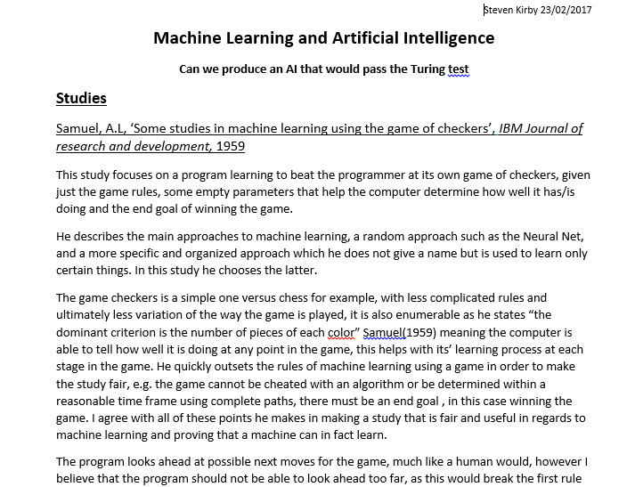
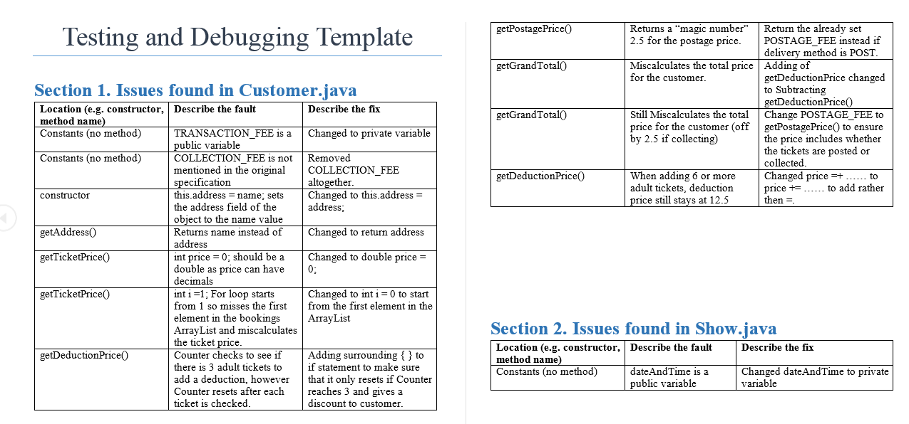
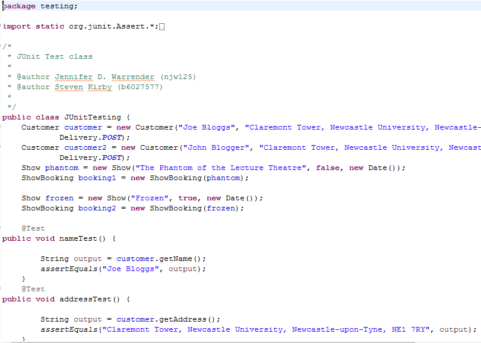
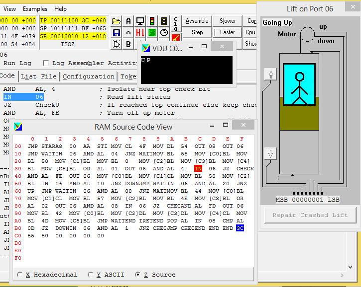
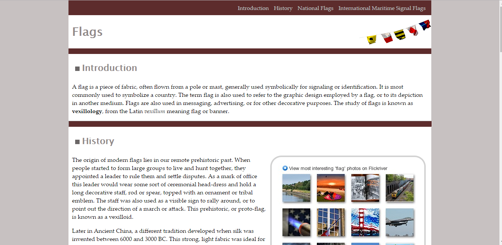

<h1 style="text-align:center;margin-top:20px;">Coursework - Year 1</h1>

<h3>CSC1021 Assignment 1 - Tax Chart and Calculator</h3>

The First coursework we were tasked with in Java involved creating a Tax Calculator which then displayed a bar chart showing income and amount to pay.

<h3>CSC1021 Assignment 2 - Hotel booking system</h3>

The Second coursework we were tasked with in Java involved creating a Hotel using OOP to allow a booking system, this did not require a GUI.

<h3>CSC1022 Assignment 1 - Browser</h3>

The coursework we were tasked with in Java in the second semester was to create a browser that would display webpages and required a GUI, we were told to use Swing for this.

<h3>CSC1023 Assignment 1 - Programming Presentation</h3>

Research and present information on a programming language of our choice, including a written report of the information also

<h3>CSC1023 Assignment 2 - Ethics in Software Engineering</h3>

This coursework involved choosing a computing disaster to discuss about, mainly the ethics behind the disaster and what happend, how it happened and what could of been done to prevent this.

The topic I decided to choose was 000webhost and their database breach of plain text information of over 13.5 million users details and passwords.

<h3>CSC1023 Assignment 3 - Usability Analysis(Sprint)</h3>

Using Nielsen's 10 Usablity Heuristics where appropriate we were tasked with testing out the universities blackboard system

<h3>CSC1023 Assignment 4 - Literature Review</h3>

Using Google Scholar we were to find 3 literature pieces from trusted and reliable sources based on a subject in computing science, I opted to choose AI and Machine Learning, this wasnt a suggested topic however I find this subject interesting.

  

<h3>CSC1023 Assignment 5 - Debugging PreWritten Code</h3>

The Code we were given had been written specifically for the purpose of testing and debugging with injected issues.

  

<h3>CSC1024 Assignment 1 - Lift Simulator</h3>

Using assembly language, we were tasked with controlling a lift.

We had a very limited amount of memory to work with.

  

<h3>CSC1026 Assignment 1 - Copy a Website using image</h3>

Using just an image and some pre written text we were tasked with marking up the text so that the page had the same underlying 
structure as a website and then using css to make it look like the final result

