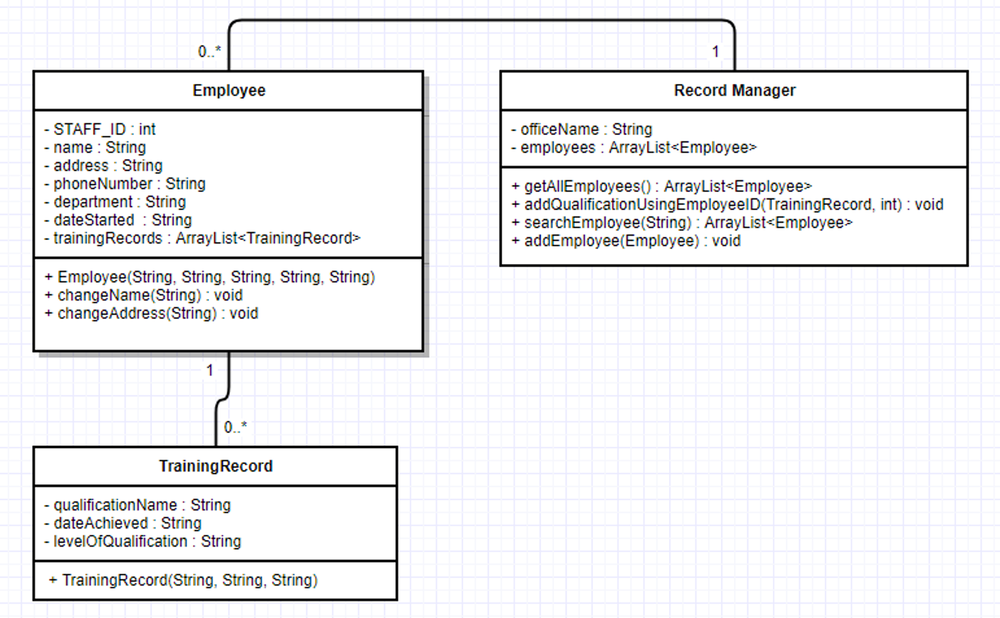
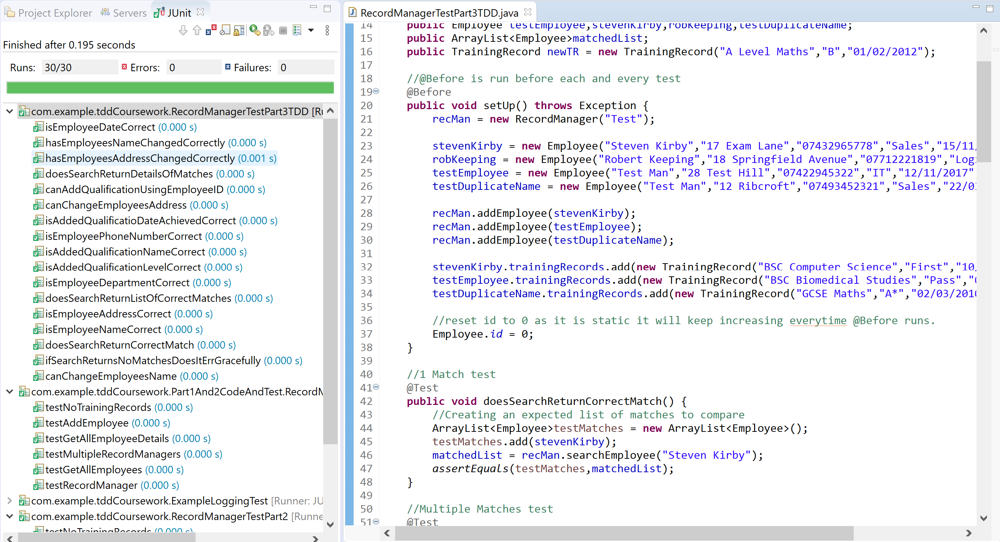
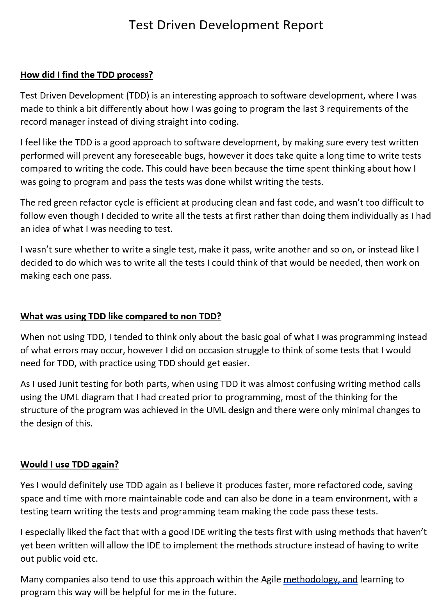

<h1 style="text-align:center;margin-top:20px;">Coursework - Year 2</h1>
<div class="row">
  <hr>
  <h2><a href="https://www.ncl.ac.uk/module-catalogue/module.php?code=CSC2021">Software Engineering</a></h2>
</div>
{::options parse_block_html="true" /}
<div class="row">
<hr>
<div class="row">
<div class="col-xs-6">
<br><br>

</div>
<div class="col-xs-6">
<h3>Assignment 1 - Test Driven Development</h3>
<p>This assignment was split into 3 tasks, the first of which being to produce a UML diagram.</p>
<p>The second task was to produce the program using the UML diagram as a base writing the code first and then the tests, the code could differ from the UML diagram as long as any changes were documented in the code</p>
<p>The third task was to program the same program, however using TDD(Test Driven Development) first, producing tests before doing any programming, we had to show the test failing and then passing once the programming was complete, this was tracked using a framework provided.</p>
</div>
</div>
<div class="row">
<details><summary markdown="span" style="text-align:right">Show me the code!</summary>

```java
package com.example.tddCoursework.Part1And2CodeAndTest;

import java.util.ArrayList;

public class RecordManagerNonTDD {
	String officeName;
	ArrayList<EmployeeNonTDD> employees = new ArrayList<EmployeeNonTDD>();
	
	
	RecordManagerNonTDD(String officeName){
		this.officeName = officeName;
	}
	
	public ArrayList<EmployeeNonTDD> getAllEmployees(){
		return employees;
	}
	
	public void addEmployee(EmployeeNonTDD employee){
		employees.add(employee);
	}
	
	public void addEmployee(String name, String address, String phoneNumber, String department, String dateStarted){
		employees.add(new EmployeeNonTDD(name,address,phoneNumber,department,dateStarted));
	}
	
	public String getAllEmployeeDetails(){
		String str = "";
		for(EmployeeNonTDD emp : employees){
			str += emp.toString();
		}
		
		return str;
		
	}
	
}

import java.util.ArrayList;

public class EmployeeNonTDD {
	final int STAFF_ID;
	public static int id = 0;
	String name;
	String address;
	String phoneNumber;
	String department;
	String dateStarted;
	ArrayList<TrainingRecordNonTDD> trainingRecords = new ArrayList<TrainingRecordNonTDD>();
	
	EmployeeNonTDD(String name, String address, String phoneNumber, String department, String dateStarted){
		
		this.STAFF_ID = id++;
		this.name = name;
		this.address = address;
		this.phoneNumber = phoneNumber;
		this.department = department;
		this.dateStarted = dateStarted;
	}
	
	public String toString(){
		String str = String.format(" %d %s %s %s %s %s Training Records[",this.STAFF_ID,this.name,this.address,this.phoneNumber,this.department,this.dateStarted);
		if (this.trainingRecords.size() < 1){
			str += "n/a";
		} else {
		for(TrainingRecordNonTDD tr : this.trainingRecords){
			str += tr.toString();
			if(tr != this.trainingRecords.get(trainingRecords.size()-1))
				str += ", ";
		}
		}
		str += "];";
		return str;	
	}
}

public class TrainingRecordNonTDD {

	String qualificationName;
	String dateAchieved;
	String levelOfQualification;
	
	TrainingRecordNonTDD(String qualificationName, String levelOfQualification ,String dateAchieved){
		this.qualificationName = qualificationName;
		this.dateAchieved = dateAchieved;
		this.levelOfQualification = levelOfQualification;
	}
	
	public String toString(){
		
		String tr = String.format("%s %s %s", this.qualificationName,this.levelOfQualification,this.dateAchieved);
		
		return tr;
	}
}
```

</details>
<br/>
<details><summary markdown="span" style="text-align:right">Show me the tests!</summary>

```java
package com.example.tddCoursework.Part1And2CodeAndTest;

import static org.junit.Assert.*;

import org.junit.*;

public class RecordManagerTestPart2 {
	
	public RecordManagerNonTDD rm,anotherRm;
	public EmployeeNonTDD testEmployee;
	public EmployeeNonTDD stevenKirby;
	
	@Before
	public void setUp(){
		
		rm = new RecordManagerNonTDD("Test");
		anotherRm = new RecordManagerNonTDD("Another");
		
		stevenKirby = new EmployeeNonTDD("Steven Kirby","17 Exam Lane","07432965778","Sales","15/11/2017");
		testEmployee = new EmployeeNonTDD("Test Man","28 Test Hill","07422945322","IT","12/11/2017");

		rm.addEmployee(stevenKirby);
		rm.addEmployee(testEmployee);
		
		stevenKirby.trainingRecords.add(new TrainingRecordNonTDD("BSC Computer Science","First","10/11/2017"));
		testEmployee.trainingRecords.add(new TrainingRecordNonTDD("BSC Biomedical Studies","Pass","05/02/2016"));

		testEmployee.trainingRecords.add(new TrainingRecordNonTDD("BSC Biomedical Studies 2","First","01/07/2016"));
		testEmployee.trainingRecords.add(new TrainingRecordNonTDD("BSC Biomedical Studies 3","Second","08/04/2017"));
		
		EmployeeNonTDD.id = 0;
	}
	
	
	
	@Test
	public void testRecordManager() {
		assertTrue(rm != null);
		
	}
	
	@Test
	public void testMultipleRecordManagers(){
		assertTrue(rm != null && anotherRm !=null && rm != anotherRm);
	}

	@Test
	public void testGetAllEmployees() {
		assertEquals(rm.employees,rm.getAllEmployees());
		
	}

	@Test
	public void testAddEmployee() {
		assertEquals(stevenKirby,rm.employees.get(0));
	}

	@Test
	public void testGetAllEmployeeDetails(){
		assertEquals(" 0 Steven Kirby 17 Exam Lane 07432965778 Sales 15/11/2017 Training Records[BSC Computer Science First 10/11/2017]; 1 Test Man 28 Test Hill 07422945322 IT 12/11/2017 Training Records[BSC Biomedical Studies Pass 05/02/2016, BSC Biomedical Studies 2 First 01/07/2016, BSC Biomedical Studies 3 Second 08/04/2017];",rm.getAllEmployeeDetails());
	}
	
	@Test
	public void testNoTrainingRecords(){
		
		stevenKirby.trainingRecords.remove(0);
		assertEquals(" 0 Steven Kirby 17 Exam Lane 07432965778 Sales 15/11/2017 Training Records[n/a]; 1 Test Man 28 Test Hill 07422945322 IT 12/11/2017 Training Records[BSC Biomedical Studies Pass 05/02/2016, BSC Biomedical Studies 2 First 01/07/2016, BSC Biomedical Studies 3 Second 08/04/2017];",rm.getAllEmployeeDetails());
	}
}
```
	
</details>
<br/>
</div>
</div>
{::options parse_block_html="false" /}
<div class="row">
  <hr>
  <div class="col-xs-6">
    
  </div>
  <div class="col-xs-6">
    <h3>Assignment 2 - Report - Test Driven Development</h3>
<p>This assignment required us to write a short report (500 words) based on our experience of producing a same piece of software with both TDD and non-TDD workflows.</p> 
  </div>
</div>
<div class="row">
  <hr>
  <h2><a href="https://www.ncl.ac.uk/module-catalogue/module.php?code=CSC2022">Software Engineering Team Project</a></h2>
</div>
<div class="row">
  <hr>
  <div class="col-xs-6">
    
  </div>
  <div class="col-xs-6">
    <h3>Assignment 1 - Web Browser</h3>
    <p>The coursework we were tasked with in Java in the second semester was to create a browser that would display webpages and required a GUI, we were told to use Swing for this.</p>
  </div>
</div>
<div class="row">
  <hr>
  <h2><a href="https://www.ncl.ac.uk/module-catalogue/module.php?code=CSC2023">Algorithm Design and Analysis</a></h2>
</div>
<div class="row">
  <hr>
  <div class="col-xs-6">
    
  </div>
  <div class="col-xs-6">
    <h3>Assignment 1 - Programming Presentation</h3>
    <p>Research and present information on a programming language of our choice, including a written report of the information also</p>
  </div>
</div>
<div class="row">
  <hr>
  <div class="col-xs-6">
    
  </div>
  <div class="col-xs-6">
    <h3>Assignment 2 - Ethics in Software Engineering</h3>
    <p>This coursework involved choosing a computing disaster to discuss about, mainly the ethics behind the disaster and what happend,how it happened and what could of been done to prevent this.</p>
    <p>The topic I decided to choose was 000webhost and their database breach of plain text information of over 13.5 million users details and passwords.</p>
  </div>
</div>
<div class="row">
  <hr>
  <div class="col-xs-6">
    
  </div>
  <div class="col-xs-6">
    <h3>Assignment 3 - Usability Analysis(Sprint)</h3>
    <p>Using Nielsen's 10 Usablity Heuristics where appropriate we were tasked with testing out the universities blackboard system</p>
  </div>
</div>
<div class="row">
  <hr>
  <div class="col-xs-6">
    
  </div>
  <div class="col-xs-6">
    <h3>Assignment 4 - Literature Review</h3>
    <p>Using Google Scholar we were to find 3 literature pieces from trusted and reliable sources based on a subject in computing science, I opted to choose AI and Machine Learning, this wasnt a suggested topic however I find this subject interesting.</p>
  </div>
</div>
<div class="row">
  <hr>
  <div class="col-xs-6">
    <br><br>
    
  </div>
  <div class="col-xs-6">
    <h3>Assignment 5 - Debugging PreWritten Code</h3>
    <p>The Code we were given had been written specifically for the purpose of testing and debugging with injected issues.</p>
  </div>
</div>
<div class="row">
  <hr>
  <h2><a href="https://www.ncl.ac.uk/module-catalogue/module.php?code=CSC2024">Database Technology</a></h2>
</div>
<div class="row">
  <hr>
  <div class="col-xs-6">
    <br><br>
  </div>
  <div class="col-xs-6">
    <h3>Assignment 1 - Lift Simulator</h3>
    <p>Using assembly language, we were tasked with controlling a lift.</p>
    <p>We had a very limited amount of memory to work with.</p>
  </div>
</div>
<div class="row">
  <hr>
  <h2><a href="https://www.ncl.ac.uk/module-catalogue/module.php?code=CSC2025">Operating Systems</a></h2>
</div>
<div class="row">
  <hr>
  <div class="col-xs-6">
    <br><br>
  </div>
  <div class="col-xs-6">
    <h3>Assignment 1 - Maths</h3>
    <p>Generic maths</p>
  </div>
</div>
<div class="row">
  <hr>
  <h2><a href="https://www.ncl.ac.uk/module-catalogue/module.php?code=CSC2026">Computer Networks</a></h2>
</div>
<div class="row">
  <hr>
  <div class="col-xs-6">
    <br><br>
  </div>
  <div class="col-xs-6">
    <h3>Assignment 1 - Copy a Website using image</h3>
    <p>Using just an image and some pre written text we were tasked with marking up the text so that the page had the same underlying 
structure as a website and then using css to make it look like the final result</p>
  </div>
</div>
