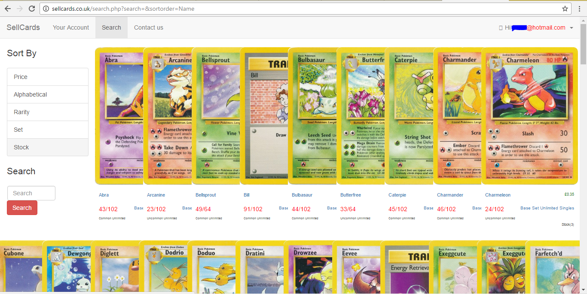
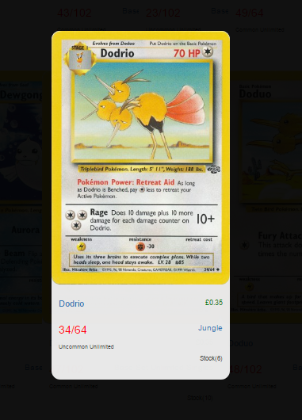
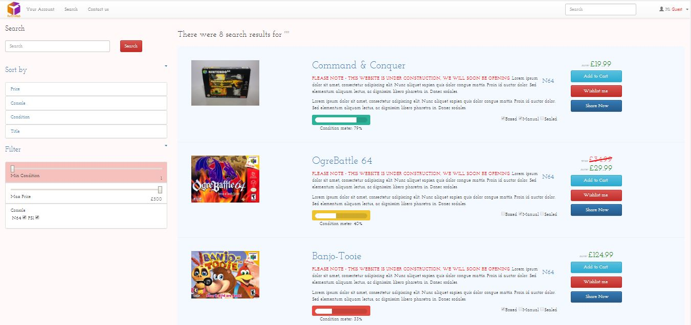
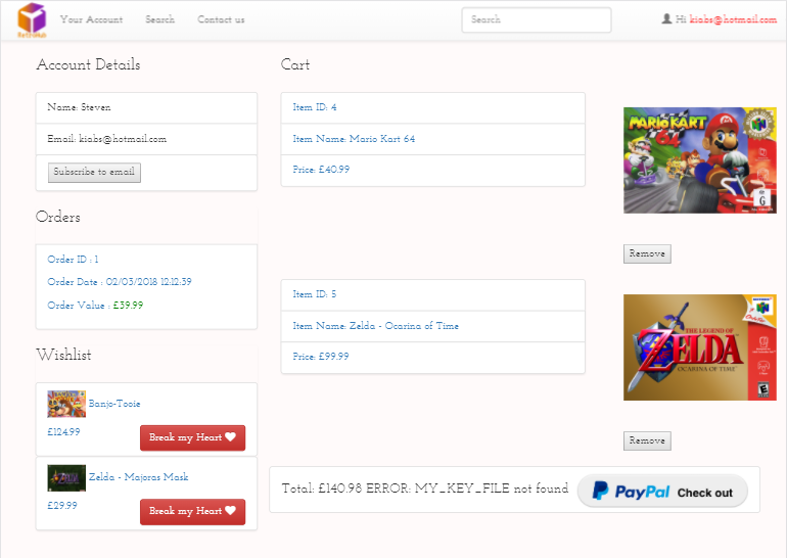
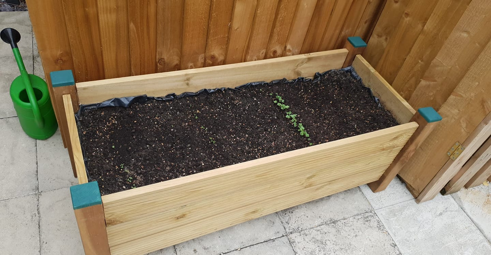

<h1 style="text-align:center;margin-top:20px;">Personal Projects - Highlights</h1>

<h2><a href="#">Retrohub.co.uk and Sellcards.co.uk - Ecommerce Websites</a></h2>

	

	

		  
		
	

	

		<h3>Stacked Cards with Transitions</h3>
		
When hovering over a card in the stack the card moves to the front and darkens the screen.

	

	

	

		<h3>Learning from Past Mistakes</h3>
		
The retrohub site is close to the sellcards site as it was built after it, taking the bits that i decided worked well, the code however is much more organised on retrohub, with a better use of templates and includes of seperated code for each page, making the website alot more maintainable.

	

  

      
		
	

  
<h2><a href="#">Other Website Development</a></h2>

  
<h2><a href="#">Photo Watermarker</a></h2>

  
<h2><a href="#">Carpentry - Planter Box</a></h2>

	

		
	

	

		
I made this planter using 2 fence posts cut in half, some decking board and using 24 mortice and tenon joints

	

  
<h2><a href="#">Gold Panning</a></h2>

