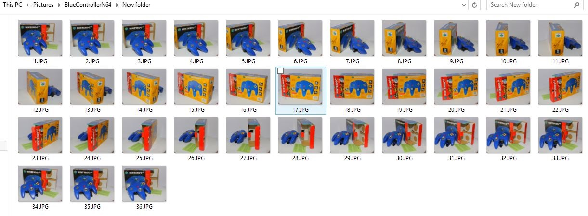
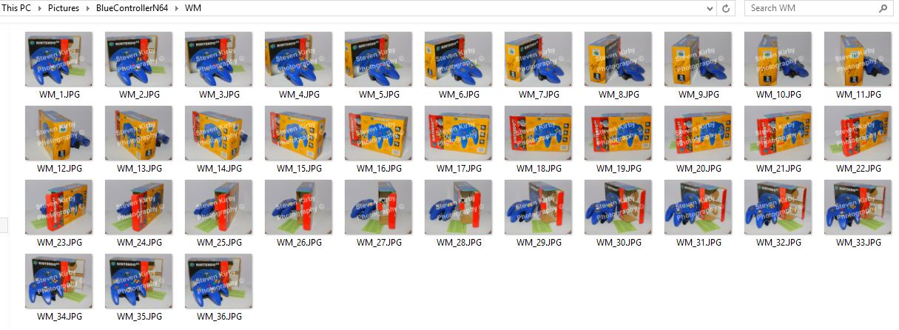
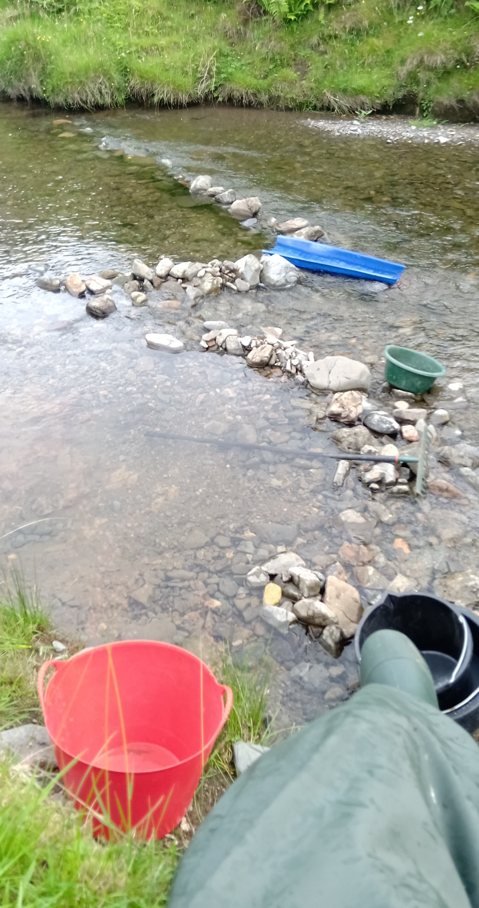
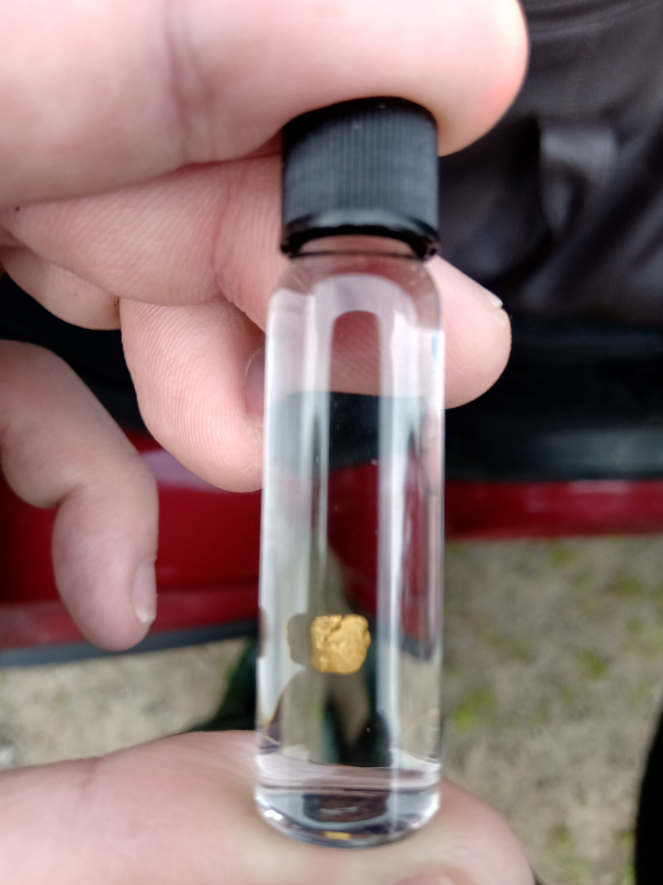

<h1 style="text-align:center;margin-top:20px;">Personal Projects - Highlights</h1>

<h2><a href="#">Retrohub.co.uk and Sellcards.co.uk - Ecommerce Websites</a></h2>

	

	

		  
		
	

	

		<h3>Stacked Cards with Transitions</h3>
		
I decided on this layout for cards as it resembles how you would spread a stack of cards out physically, although maybe at more of a fan spread.

		
When hovering over a card in the stack the card moves to the front and darkens the screen to allow the user to more closely see the card, they could then click on the card to see it on its own page and add to the users cart.

	

	

		<h3>Learning from Past Mistakes</h3>
		
The retrohub site is close to the sellcards site as it was built after it, taking the bits that i decided worked well, the code however is much more organised on retrohub, with a better use of templates and includes of seperated code for each page, making the website alot more maintainable.

	

  	

    		  
		
	

  
<h2><a href="#">Photo Watermarker</a></h2>

	

		  
		
	

	

		
This program was made for a friend who was paying for a website to watermark her photography with a very simple overlay and required her to upload each photograph.
 
	

  
<h2><a href="#">Carpentry - Planter Box</a></h2>

	

		
	

	

		<h3>The Finished Product</h3>
		
The materials used for this planter included 2 fence posts cut in half, some decking board, a small tester pot of waterproofing paint and some screws.

		
I chiselled 24 mortice and tenon joints for the side walls, screwed the bottom on and drilled some large drainage holes, stapled the lining to the edges leaving holes for drainage, covered the holes with large stones and filled with soil.

	

  
<h2><a href="#">Gold Panning</a></h2>

 

	

		
	

	

		<h3>'Gold Fever'</h3>
		
Gold panning is a hobby I share with my dad, we have been doing this since we caught 'gold fever' almost 10 years ago on a guided lesson, sadly we dont get to go often as it is a long distance to travel.

		
There is a lot of hard physical work involved for the chance of finding small pieces of gold. But it isn't about the value of the gold. It's the thrill of the hunt and spending time outdoors around great landscapes.

	

	

	

		<h3>Result!</h3>
		
This is one of the bigger pieces of gold we have found, the sound of the gold 'tinking' against the glass vial, knowing it has never been touched before is awe inspiring to me.

	

	

		
	

