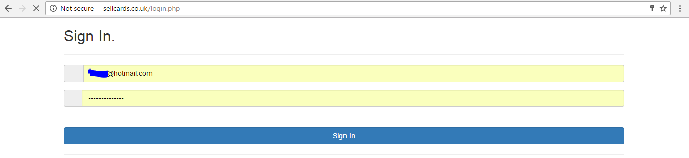
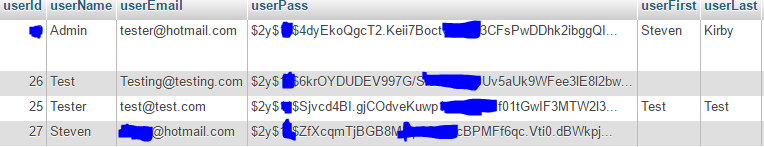
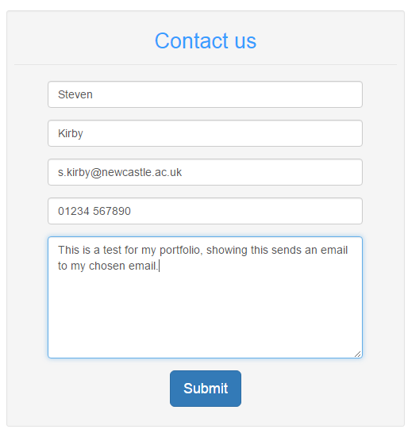
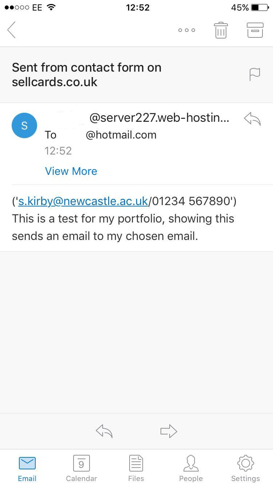
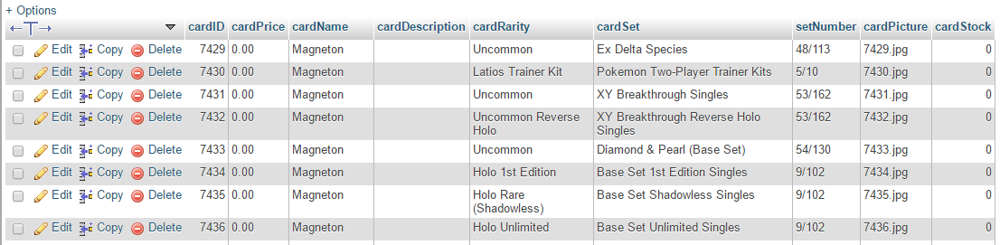
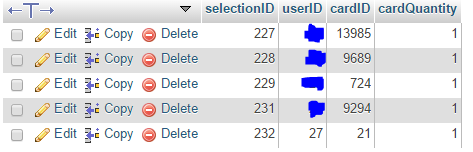

<h1 style="text-align:center;margin-top:20px;">Website Development</h1>

  

  <h2><a href="#">Freegram.co.uk (Wordpress Blog/Charity Site)</a></h2>

	

	

		
            

	

		<h3>WordPress/Social Media Login</h3>
		
The site uses WordPress and enables users to signup and login with facebook, google, twitter or youtube quickly and securely in a couple of clicks

	

	

	

		
	

	

		<h3>Blog Categories</h3>
		
I Chose to layout the site as a Blog, which would enable users to post their own blogs, projects and news by setting the correct category they could be seperated and easily found

		
The main categories include News, Blogs and Projects, this is because the site is primarily supposed to be aimed toward companies with little to no budget/charities who need programming jobs done in exchange for a programmer to gain experience and a reference to add to their portfolio

	

	

	

            
	

	

		<h3>Editing of Plugins</h3>
		
The use of plugins make it very easy to knock up a website in a very short time with great functionality, however to get the very best out of wordpress, you need the ability to edit or modify plugins to your liking, i have done this here with limited success as it is a very manual process, by disincluding my own posts into the blogs by users, and likewise with only including my own blogs in the blogs by me section

		
Blogs by users will only show other peoples blogs, Blogs by Freegram will only show the blogs posted by me

		
I also replicated the behaviour of showing all posts whereby the picture for the post is showing beside the blurb as this was not a default option with the plugin i used.

	

	

	

		
	

	

		<h3>Tutorial Island</h3>
		
This page is a one stop place for many of a budding programmers needs to learn, without having to leave the page they have access to alot of resources from youtube about web development, programming and SEO

	

	

	

		
            

	

		<h3>Social Media</h3>
		
Using the simple application IFTTT, if this then that, i have made each and every blog, news or project that is posted, also be posted to facebook and twitter.

            

	

	

		
	

	

		<h3>Custom HTML Pages</h3>
		
Of course just because the website uses wordpress predominantly, there is no reason why not to use custom html pages, as such i have created a smoking calculator, and of course this portfolio will be on a custom page on this website

	

  

  <h2><a href="#">SellCards.co.uk (Ecommerce Site)</a></h2>

	

	

		
		
	

	

		<h3>PHP Login/SQL Database</h3>
		
Hashing of user passwords using bcrypt

		
User can sign up, however no email verification is in place, and log in using this email and the password chosen.

		
The website is Secure and uses https:// however it doesnt redirect to this when accessing over http://, this is shown here

		
There is an issue i need to fix regarding guest access where it is checking too often whether a user is logged in causing the website to run slowly until the user logs in

	

	

	

		
		 
	

	

		<h3>PHP Mail</h3>
		
Uses GET to pass the data to the mail php file, although this potentially allows for spam requests so will be changing this to post.

		
Below is the code for this as it was short i have included it.

		<code>&lt;?php 
			$name=$_GET['name']; 
			$email=$_GET['email']; 
			$phone=$_GET['phone']; 
			$message=$_GET['message'];  	
			$to = "Email@EMail.com"; 
			$subject = "Sent from contact form on sellcards.co.uk"; 
			$txt = $name." ('".$email."/".$phone."') ".$message; 
			mail($to,$subject,$txt); 
			header( 'Location: https://sellcards.co.uk/index.php' ) ; 
			?&gt</code>
	

	

	

		  
		  
		
	

	

		<h3>PHP/SQL Search & Sort</h3>
		
This function works by reloading the page with new GET parameters which it reads to determine how to order the cards

		
A Query is sent to the database and returns the cards based on the above paramaters and the search parameter

		
This returns back an array of cards which are displayed in rows on the page to the user, the more results that are returned however the longer it takes to load, other then this it is a quick function

		<h3>CSS Transition</h3>
            
Upon hovering over each card, the background will go black, and the card will enlarge and remain highlighted as well as pop out in front of the other cards

		
This took alot of trial and error, however the result is very satisfactory.

		
	

        

	

        

		  
		  
		
	

	

		<h3>PHP/SQL Cart & PayPal</h3>
		
The account page includes all the items that the user has added to their cart, able to remove these and is stored in a seperate table in the database, with the fields below to create a connection or foriegn key between tables

		
The user's details are also included on this page and in the future i will make this editible by the user

		
Once the user has decided to buy the cards in their cart, they can checkout with paypal either by logging in or as a guest, secure and quick.

		
The PayPal method i used allows the listing of each item in the transaction, although easier using the built in PayPal buttons, this was not viable for the quantity of different items that my site could potentially handle, just over 15000 if you were wondering, and possibly more depending on any diversity of items decided to be sold. 

		<code>$sql="SELECT * FROM cart WHERE userID =".$_SESSION['user'];</code> 
		
This is a simple sql query using php to get relevent information to select everything from the current users cart.

		<code>while ($row = mysqli_fetch_array($query)){ 
			&emsp;&emsp;&emsp;$query2 = mysqli_query($conn,"SELECT * FROM card WHERE cardID={$row['cardID']}"); 
			&emsp;&emsp;&emsp;while($row2 = mysqli_fetch_array($query2)){ 
			&emsp;&emsp;&emsp;&emsp;&emsp;&emsp;${'item'.$i} = $row2['cardName']; 
			&emsp;&emsp;&emsp;&emsp;&emsp;&emsp;$i+=1; 
			&emsp;&emsp;&emsp;&emsp;&emsp;&emsp;${'item'.$i} = $row2['cardPrice']; 
			&emsp;&emsp;&emsp;&emsp;&emsp;&emsp;$i+=1; 
			&emsp;&emsp;&emsp;} 
			}</code> 
            
This takes the results of the last query and creates another query for each card that was in the cart of the current user returning the card details such as name and price, and adds it to the PayPal itemlist with its requirement to have a name and a price for each item.

	

