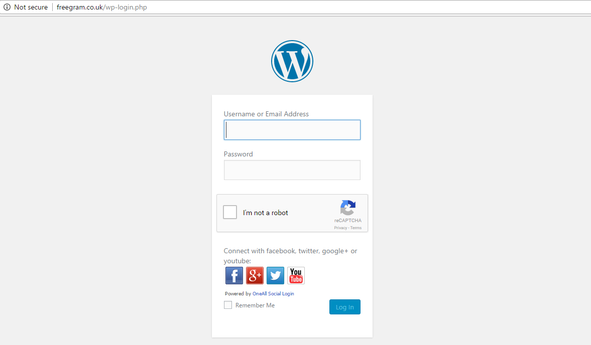
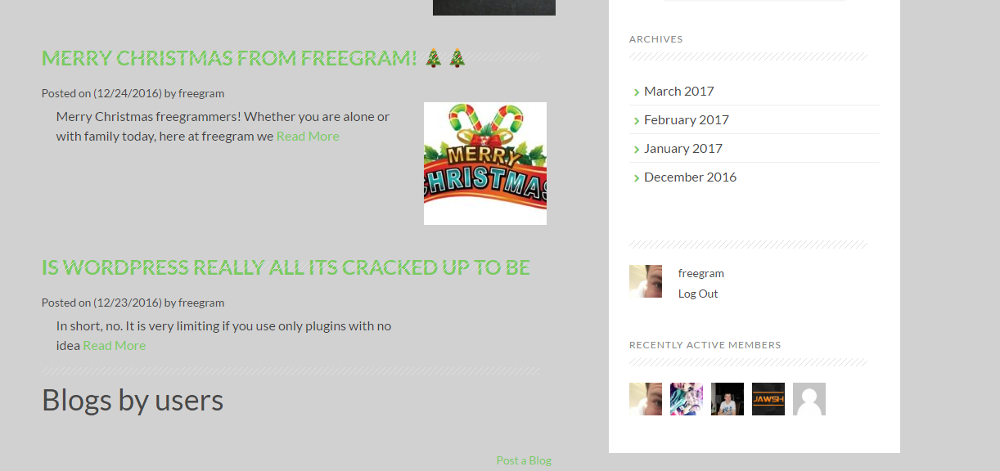
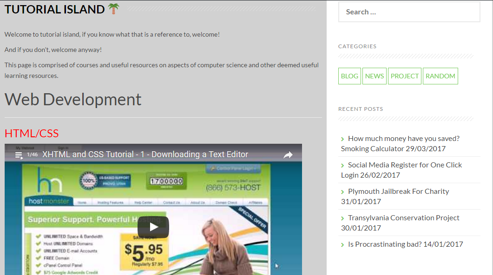
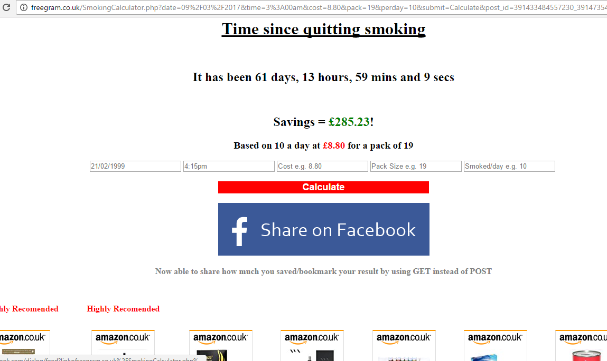

<h1 style="text-align:center;margin-top:20px;">Website Development</h1>

  

  <h2><a href="#">Freegram.co.uk</a></h2>

	

	

		
            

	

		<h3>WordPress/Social Media Login</h3>
		
The site uses WordPress and enables users to signup and login with facebook, google, twitter or youtube quickly and securely in a couple of clicks

	

	

	

		
	

	

		<h3>Blog Categories</h3>
		
I Chose to layout the site as a Blog, which would enable users to post their own blogs, projects and news by setting the correct category they could be seperated and easily found

		
The main categories include News, Blogs and Projects, this is because the site is primarily supposed to be aimed toward companies with little to no budget/charities who need programming jobs done in exchange for a programmer to gain experience and a reference to add to their portfolio

	

	

	

            
	

	

		<h3>Editing of Plugins</h3>
		
The use of plugins make it very easy to knock up a website in a very short time with great functionality, however to get the very best out of wordpress, you need the ability to edit or modify plugins to your liking, i have done this here with limited success as it is a very manual process, by disincluding my own posts into the blogs by users, and likewise with only including my own blogs in the blogs by me section

		
Blogs by users will only show other peoples blogs, Blogs by Freegram will only show the blogs posted by me

		
I also replicated the behaviour of showing all posts whereby the picture for the post is showing beside the blurb as this was not a default option with the plugin i used.

	

	

	

		
	

	

		<h3>Tutorial Island</h3>
		
This page is a one stop place for many of a budding programmers needs to learn, without having to leave the page they have access to alot of resources from youtube about web development, programming and SEO

	

	

	

		
            

	

		<h3>Social Media</h3>
		
Using the simple application IFTTT, if this then that, i have made each and every blog, news or project that is posted, also be posted to facebook and twitter.

            

	

	

		
	

	

		<h3>Custom HTML Pages</h3>
		
Of course just because the website uses wordpress predominantly, there is no reason why not to use custom html pages, as such i have created a smoking calculator, and of course this portfolio will be on a custom page on this website

	

